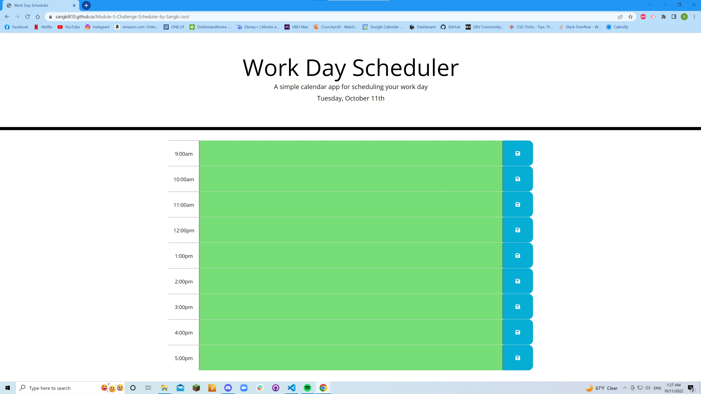

# Module 5 Challenge: Work Day Scheduler by Sangki Jun
## Description
This site functions as a day-to-day scheduler for people who work the standard 9-5 jobs. The purpose of creating this site was for the creator to practice using moment and JQuery to create a site based on a starter code given by the UCF FSF Bootcamp. This page is intended for anyone who wishes to use it as described below or to check out the codes in the repository.
## Installations
N/A
## Usage
The site lists each hour from 9 a.m. to 5 p.m. with a text area and a save button. Whatever a user inputs into the text area and chooses to save is retained on the page until erased. Each text area for the hours are color-coded to represent past, present, and future hours for reference.
## Credits
Heather Cooper 
https://github.com/EdenKhaos 
https://github.com/EdenKhaos/05-work-day-scheduler 
Listed above is the github repository and the profile page of the person whom I took direct/indirect references from for my own site.
## License
N/A
## Links and Screenshot
https://sangki810.github.io/Module-5-Challenge-Scheduler-by-Sangki-Jun/ 
